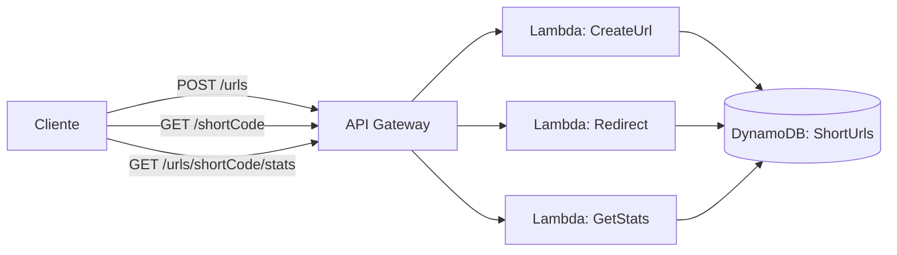

# 🔗 URL Shortener Serverless — AWS Lambda + API Gateway + DynamoDB


Prova de conceito em código do guia [Arquitetando AWS](../arquitetando-aws): uma API de encurtador de URLs 100% serverless, usando **Lambda**, **API Gateway** e **DynamoDB**, com infraestrutura definida em código via **AWS SAM**.

## 🧠 Por que este exemplo

Encurtador de URL é o "hello world" clássico de arquitetura serverless porque, em pouco código, cobre os três padrões mais comuns do modelo:
- **Escrita simples** (criar um registro) → `POST /urls`
- **Leitura de alta frequência com efeito colateral** (redirecionar e contar) → `GET /{shortCode}`
- **Leitura de consulta** (estatísticas) → `GET /urls/{shortCode}/stats`

## 🏗️ Arquitetura



## 📦 Endpoints

| Método | Rota | O que faz |
|---|---|---|
| `POST` | `/urls` | Recebe `{"url": "https://..."}`, gera um código curto único e salva |
| `GET` | `/{shortCode}` | Redireciona (302) para a URL original e incrementa `clickCount` |
| `GET` | `/urls/{shortCode}/stats` | Retorna `originalUrl`, `createdAt` e `clickCount` |

## ✅ Testado antes de subir pra AWS

Os 3 handlers foram testados localmente com [`moto`](https://github.com/getmoto/moto) (mock de DynamoDB), cobrindo:
- Criação de URL válida e inválida (URL vazia, sem `http(s)://`, JSON malformado)
- Redirecionamento com incremento atômico de cliques (`update_item` com `ADD`, evitando race condition de fazer get+put separado)
- Fluxo completo: criar → redirecionar 3x → conferir que `clickCount == 3`
- Casos de erro: código inexistente retorna `404` tanto no redirect quanto nas estatísticas

## 🚀 Como rodar

### Pré-requisitos
- [AWS SAM CLI](https://docs.aws.amazon.com/serverless-application-model/latest/developerguide/install-sam-cli.html)
- Uma conta AWS configurada (`aws configure`)
- Docker (para testar localmente antes do deploy)

### 1. Build

```bash
sam build
```

### 2. Testar localmente (sem custo, sem subir nada pra AWS ainda)

```bash
sam local start-api
```

Isso sobe a API em `http://localhost:3000`. Em outro terminal:

```bash
# Criar uma URL curta
curl -X POST http://localhost:3000/urls \
  -H "Content-Type: application/json" \
  -d '{"url": "https://github.com/gabrielteramae"}'

# Redirecionar (troque {shortCode} pelo código retornado acima)
curl -v http://localhost:3000/{shortCode}

# Ver estatísticas
curl http://localhost:3000/urls/{shortCode}/stats
```

> Nota: `sam local start-api` simula o Lambda localmente via Docker, mas ainda precisa de uma tabela DynamoDB real (local ou na AWS) — configure `AWS_SAM_LOCAL` com [DynamoDB Local](https://docs.aws.amazon.com/amazondynamodb/latest/developerguide/DynamoDBLocal.html) se quiser testar 100% offline.

### 3. Deploy de verdade na AWS

```bash
sam deploy --guided
```

Na primeira vez, o `--guided` pergunta o nome da stack, região e confirma a criação dos recursos (Lambda, API Gateway, DynamoDB, roles IAM). As próximas vezes, basta `sam deploy`.

Ao final, o output mostra a URL da API (`ApiBaseUrl`) — é só trocar `localhost:3000` pela URL real nos `curl` acima.

### 4. Destruir tudo (evitar custos)

```bash
sam delete
```

## 🔍 Rodar os testes unitários (mock, sem AWS)

```bash
pip install boto3 moto[dynamodb]
python3 tests/test_create_url.py
python3 tests/test_full_flow.py
```

## 💰 Custo esperado

Com o **free tier da AWS**, esse projeto roda essencialmente de graça para uso de portfólio/demonstração:
- Lambda: 1M requisições grátis/mês
- API Gateway: 1M chamadas grátis/mês (nos primeiros 12 meses)
- DynamoDB: 25GB de armazenamento grátis (on-demand tem custo por requisição, mas irrisório nesse volume)

## 🗺️ Relação com o guia de arquitetura

Este projeto aplica diretamente a "regra prática" do [guia Arquitetando AWS](../arquitetando-aws/README.md#1-computação): carga esporádica e orientada a evento → Lambda. Não existe servidor rodando 24/7 — cada requisição aciona uma função, e você paga só pelo que usa.

---

© 2026 Gabriel Teramae Chan
